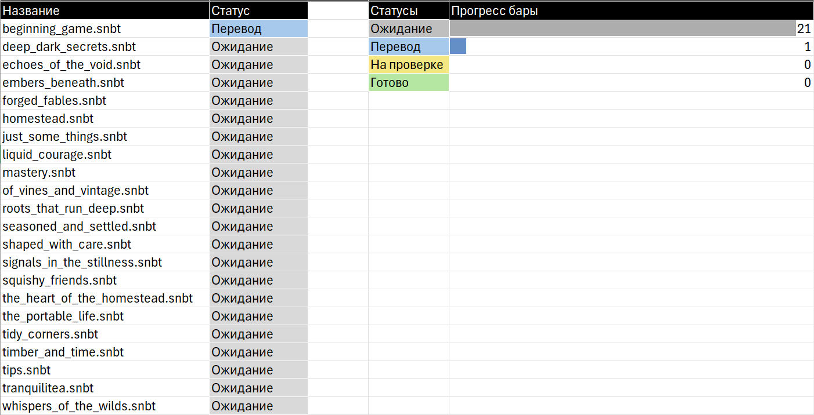
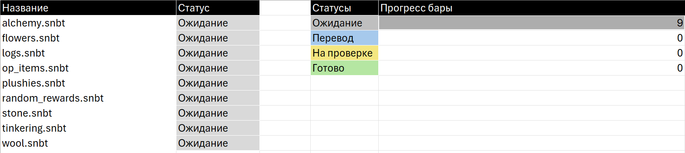

<br>
# Translation RU Homestead
Любительский перевод `Vanilla+ & Create` сборки модов [Homestead](https://modrinth.com/modpack/homestead)

## ⚙️ Установка
**ПРЕДУПРЕЖДЕНИЕ!!!**
```
Перевод все еще АБСОЛЮТНО не готов!!!
```
Для установки сначала скачайте сборку, затем репозиторий любым удобным способом и перенесите в корневую папку модпака ТОЛЬКО папки `config` и `patchouli_books`

## 📦 О сборке 
Версия Minecraft: `Fabric 1.20.1`

Сборка модов представляет собой набор приключенческих, декоративных, `Vanilla+` модов, основной акцент сделан на создании ламповой атмосферы. Кроме того, также присутствуют такие технологические моды, как [Create](https://modrinth.com/mod/create-fabric), [Tom's Simple Storage](https://modrinth.com/mod/toms-storage) и [Wireless Redstone](https://modrinth.com/mod/wirelessredstone), которые были сбалансированы под деревенскую атмосферу (убран высокотехнологичный хаос)

## 📅 Планы перевода 
На данный момент в репозитории находятся все файлы, которые будут переведены, включающие:
- Patchouli книги
- FTB квесты

Прогресс будет отслеживаться в таблице `Homestead.xlsx`. На данный момент он выглядит следующим образом:

### FTB квесты
`config/quests/chapters`



`config/quests/reward_tables`


### Patchouli книги
_IN PROGRESS_


